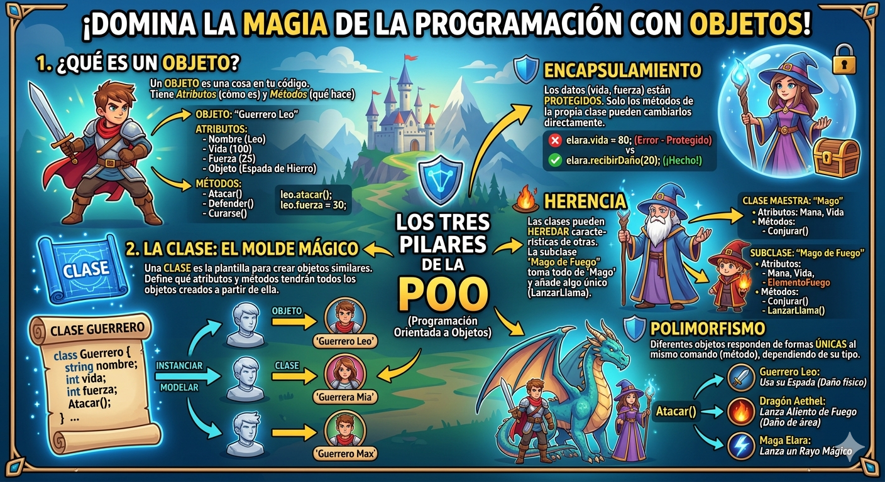

# POO en python
introduccion o programacion orientada a Objetos (POO) en python

## ¿por que aprender POO?

- imagina que quieres creear un videojuego. tienen gerreros, magos, dragones... cada uno con sus  propios puntos de vida, ataques y habilidades. ¿como los organizo en codigo sin repetir todo una y la otra vez?

- la **programacion orientada a objetos (POO)** es la respuesta. en lugar de escribir instrucciones sueltas, modelas el mundo real con *objetos* que tienen caracteristicas y comportamientos. es la forma en que estan construidos la mayoria de los propramas profesionales del mundo.



## clase y objeto

- una clase es un tipo de dato cuyas variables se llaman objetos o instancias.

- la clase es la definicion del concepto del mundo real y los objetos o instancias son el propio "objeto" del mundo real.

- las clases estan compuestas por dos elementos:
     -  ***Atributos:** informacion que alamecena la clase.
     - ** Metodos:** operaciones que pueden realizarse con la clase.

## definicion de una clase de python

```python
class nombreclase:

    def__init__(self, variable1, variable2):
        self.atributo1 = valor1
        self.atributo2 = valor2

        def nombremetodo(self):
            bloquecodigo
```

- `class` :palabra reservada en python para defnir una clase.
- `nombreclase` : nombre de la clase que se quiere crear.
- `def` : palabra reserevada en python que se utiliza para definir tanto el constructor de la clase (metodo que se ejecuta la primera vez que usas una clase) como los diferentes metodos que tiene.
- `__init__`: palabra reservada en python para definir el metodo constructor de la clase. el metodo `__init__` es lo primero que se ejecuta cuando creas un objeto de una clase.
- `(self, variableX)`: parametro del constructor de la clase. el parametro `self` es obligatorio y despues tener tantos parametros como quieras. la forma de añadir parametros es la misma que en las funciones.
- `self.AtributoX`: forma de utilizacion y ecceso a los atributos de la clase.
- `nombremetodo`: nombre del metodo de la clase.
-`self`: parametro del metodo. el parametro `self` es obligatorio y despues puedes tener tantos parametros como quieras. la forma de añadir parametros es la misma que en las funciones.
- `bloquecodigo` : instrucciones que ejecutara el metodo.

** Al defenir una clase tenga en cuenta:**
- puedes definir tantos atributos como necesidades
- puedes definir tantos metodos como necesites 
- puedes definir tanto parametros en el constructor y en los metodos como necesites.

## ejemplo 1

- crear una clase que represente una persona.
- atributos: nombre, apellidos y edad.
- metodos: mostrar la informacion de la persona.

###  codigo

``` python
class persona:

    # metodo constructor de la clase 

    def __init__(self, nombre, apellido, edad):
        self.nombre = nombre
        self.apellido = apellido
        self.edad = edad

    # metodo para mostrar la informacion de la persona
    def mostarpersonas(self):
        print("nombre: ", self.nombre)
        print("apellidos: ", self.apellidos)
        print("edad: ", self.edad)

def main():
    print("vamos a prender POO...")
    persona_1 = persona("lorenzo", "perez", 18)
    persona_1.mostrarpersona

if __name__ == main():
    main()
```

## composicion

- consiste en la creacion de nuevas clases a partir de otras clases existentes q actuen como elementos compositorios de la nueva.
- las clases existenten seran atributos de la nueva clase.

## ejemplos 

- un cordenada en dos dimensiones esta compuesta por dos valores, el valor entre las x y el valor de la y. esto podria ser una clase.
- un cuadrado esta compuesto por 4 cordenadas que son los cuarto vertices. esto podria seruna clase que esta compuesta por cuatro clases del objeto coordenada 

### codigo python
```python 
class cordenada :
    # metodo constructor 
    def __init__(self, x, y):
        self.x = x
        self.y = y

        def mostrarcordenada(self):
            print("(",self.x,",",self.y, ")")

class cuadrado :
    # metodo constructor
    def __init__(self, v1, v2, v3, v4):
        self.v1 = v1
        self.v2 = v2
        self.v3 = v3
        self.v4 = v4

        def mostrarvertices(self):
            print("el cuadrado esta compuesto por los siguientes vertices:")
            self.v1.mostrarcordenada()
            self.v2.mostrarcordenada()
            self.v3.mostrarcordenada()
            self.v4.mostrarcordenada()
```

## representacion de RAM de la composicion


## encapsulacion

- uno de los objetivos que tiene POO es proteger los datos de acceso no controlados, y esto es loo que se conoce como **encapslacion**.
- los datos (atributos) que componen una clase pueden ser de dos tipos:
       - **publicos:** los datos son accesibles sin control y para acceder a ellos. de manera, los datos unicamente seran accedidos directamente por la propia clase.
- la encapsulacion tambien puede realizarse sobre los metodos.
- la definicion de atributos privados se realiza incluyendo los caracteres "__" (dos guiones de piso) entre la palabra *self* y el nombre del atributo.

## ejemplo 

### codigo python
```python 
class cordenada :
    # metodo constructor 
    def __init__(self, x, y):
        self.__x = x
        self.__y = y

        # metodo de acceso
        def getX(self):
            return self.__X

        def setX(self, X):
            self.__X = X

        def getX(self):
            return self.__Y

        def sety(self, y):
            self.__y = y

        # metodo para mostrar la cordenda 
        def mostrarcordenada(self)
        print("(",self.__x,",",self.__y, ")")

        def mostrarcordenada(self):
            print("(",self.x,",",self.y, ")")

class cuadrado :
    # metodo constructor
    def __init__(self, v1, v2, v3, v4):
        self.v1 = v1
        self.v2 = v2
        self.v3 = v3
        self.v4 = v4

        def mostrarvertices(self):
            print("el cuadrado esta compuesto por los siguientes vertices:")
            self.v1.mostrarcordenada()
            self.v2.mostrarcordenada()
            self.v3.mostrarcordenada()
            self.v4.mostrarcordenada()
```
 Herencia
- Permite la reutilización de código.
- Consiste en la definición de una clase utilizando como base una clase ya existente.
- La nueva clase derivada tendrá todas las caracteristicas de la clase base y ampliará el concepto de esta, es decir, tendrá todos los atributos y métodos de la clase base.
- Significa que entre dos clases existe una relación del tipo "es un".
- La herencia en Python se especifica de la siguiente manera: ```class NombreClase(ClaseBase):```
- Ejemplo:
    - Pensemos en una persona como una clase, la persona tendría una serie de atributos como pueden ser el nombre, los apellidos, la edad, etc.  Esas características de una persona serían compartidas por todas aquellas clases hijas como pueden ser alumno y profesor.  Es decir, alumno y profesor heredarían las propiedades de la clase persona y tendrían sus propias propiedades, diferentes entre ellas, como por ejemplo el curso en el que está el alumno y el horario de tutorias del profesor.

    - Clase base: Persona
        - Atributos:
            - Nombre
            - Apellidos
            - Edad

    - Clase derivada: Alumno
        - Atributos:
            - Curso
            - Asignaturas
    
    - Clase derivada: Profesor
        - Atributos:
            - Antigüedad
            - Tutorias
            - Teléfono